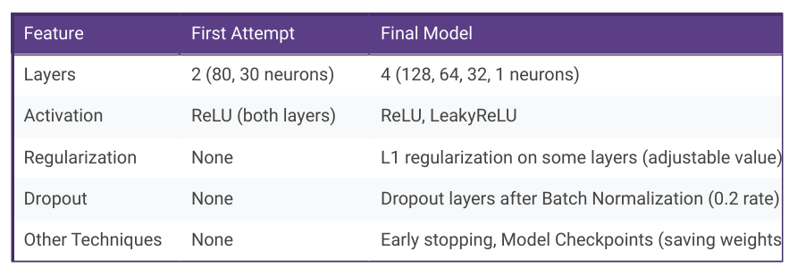

# deep-learning-challenge

# Module 21 Report 

## Overview of the Analysis

The nonprofit foundation Alphabet Soup wants a tool that can help it select the applicants for funding with the best chance of success in their ventures. Using the features in the provided dataset create a binary classifier that can predict whether applicants will be successful if funded by Alphabet Soup.

Alphabet Soup’s business team provided a CSV containing more than 34,000 organizations that have received funding from Alphabet Soup. Within this dataset are a number of columns that capture metadata about each organization, such as:

EIN and NAME — Identification columns
APPLICATION_TYPE — Alphabet Soup application type
AFFILIATION — Affiliated sector of industry
CLASSIFICATION — Government organization classification
USE_CASE — Use case for funding
ORGANIZATION — Organization type
STATUS— Active status
INCOME_AMT — Income classification
SPECIAL_CONSIDERATIONS — Special considerations for application
ASK_AMT — Funding amount requested
IS_SUCCESSFUL — Was the money used effectively

### Data Preprocessing

* What variable(s) are the target(s) for your model?

    - IS_SUCCESSFUL: This variable indicates whether the funding was used effectively. It contains binary values (0 or 1) representing unsuccessful and successful ventures.

* What variable(s) are the features for your model?

    - APPLICATION_TYPE: This describes the type of application submitted to Alphabet Soup.
    - AFFILIATION: The sector of industry the organization is affiliated with.
    - CLASSIFICATION: The government classification of the organization (if applicable).
    - USE_CASE: The intended purpose for which the funding was requested.
    - ORGANIZATION: The type of organization (e.g., non-profit, educational institution).
    - STATUS: This likely indicates the current active status of the organization.
    - INCOME_AMT: This describes the income classification of the organization.
    - SPECIAL_CONSIDERATIONS: This might highlight any special factors considered during the application review.
    - ASK_AMT: The amount of funding requested by the organization.

* What variable(s) should be removed from the input data because they are neither targets nor features?

    - EIN: This is a unique identifier for the organization and doesn't contribute to predicting success.
    - NAME: The organization's name is not relevant for predicting application success.

### Compiling, Training, and Evaluating the Model

* How many neurons, layers, and activation functions did you select for your neural network model, and why?

    Layers: Four dense layers. Deep neural networks can capture complex patterns in data, and increasing the number of layers can potentially improve model performance.
    Neurons: 128, 64, 32, and 1 neurons in each respective layer. Different layers can focus on extracting different levels of features. The first layer commonly has a larger number of neurons to capture a wide range of information, and subsequent layers gradually reduce dimensionality.
    Activation Functions: ReLU for the first and third layers, LeakyReLU for the second layer, and sigmoid in the output layer. These activation functions are typical choices for hidden layers as they help address the vanishing gradient problem and provide non-linearity. The sigmoid activation is often used for the output layer as it produces probabilities between 0 and 1 for binary classification.

* Were you able to achieve the target model performance?

Considering target accuracy of 75%, the developed model fell short. The achieved accuracy of 73.08% is relatively close to the target, although it doesn't meet the expected threshold.

* What steps did you take in your attempts to increase model performance?

In the following table, we can see the actions taken to improve model performance:

Description of improvements:

Increased Model Capacity: The final model has more layers (4 vs. 2) and more neurons in the first layer (128 vs. 80), potentially allowing to learn more complex relationships.
Regularization: L1 regularization is added to some layers, penalizing large weights and helping prevent overfitting.
Batch Normalization and Dropout: These tools in the final model help in training stability and prevent overfitting.
Early Stopping: This helps prevent overfitting by stopping training when validation loss doesn't improve for a set number of epochs.
Model Checkpoints: These save model weights at specific points, allowing to revert to the best performing model.

### Summary: 

The deep learning model achieved a final accuracy of 73.08% on the test set, with a corresponding loss of 0.5753. This shows a moderately successful model in predicting whether an applicant will be successful or not. Even though it provides reasonable performance, there is room for improvement.

It's worth exploring other models that prove strong performance in classification tasks. Gradient Boosting Machines (GBMs) and XGBoost are ensemble methods known for their ability to handle complex relationships between features and the target variable. 

Note: It's essential to consider the trade-offs between different model types, including interpretability, computational cost, and performance. Experimentation is key and hyperparameter tuning is often necessary to find the optimal solution for a given problem.

